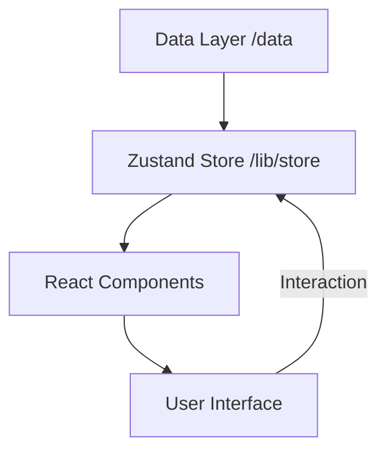

# Project Architecture

This document provides a high-level overview of the technical architecture of this personal website.

## Technology Stack

- **Framework**: [Next.js](https://nextjs.org/) (App Router)
- **Runtime & Package Manager**: [Bun.js](https://bun.sh/)
- **Styling**: Vanilla CSS with [Tailwind CSS](https://tailwindcss.com/) for utility classes.
- **State Management**: [Zustand](https://github.com/pmndrs/zustand)
- **3D Graphics**: [Three.js](https://threejs.org/) via [React Three Fiber](https://docs.pmnd.rs/react-three-fiber/getting-started/introduction)
- **Animations**: [Framer Motion](https://www.framer.com/motion/)
- **Testing**: [Vitest](https://vitest.dev/) (Unit) and [Playwright](https://playwright.dev/) (E2E)

## Core Systems

### 1. Data Layer (`/data`)
The data layer is modularized to avoid monolithic files. Core entities (Anime, Books, Experience) are defined here using TypeScript interfaces.
- **Anime**: Split into `completed.ts`, `planning.ts`, and `movies.ts`.
- **Books**: Contains categorized reading list and key takeaways.

### 2. State Management (`/lib/store`)
Uses Zustand for global application state, organized into slices:
- `musicSlice`: Manages playback, playlist, and audio player visibility.
- `uiSlice`: Manages interactive elements and section expansion.
- `terminalSlice`: Handles the integrated terminal state and history.

### 3. Music Player System (`/components/features/music-player`)
A complex UI featuring:
- Custom `useAudio` hook for hardware-level audio control.
- `TrackInfo`, `ProgressBar`, `VolumeControl`, and `Controls` sub-components.
- Integrated `audioAnalyzer` for visual feedback (where applicable).

## Data Flow

## Testing Strategy
- **Unit Tests**: Focus on the data layer integrity and utility functions.
- **E2E Tests**: Focus on critical user paths (Music Player interactions, Navigation).
